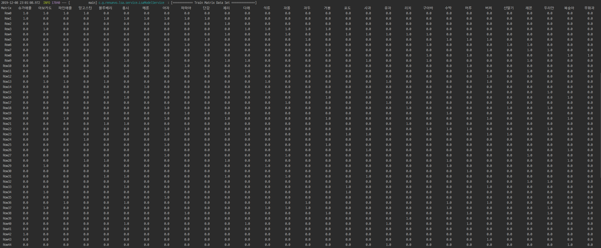

# LSA Algorithm 
***(Latent Semantic Analysis : 잠재적의미 분석)***  

**LSA**는 `차원축소`와 `동시발생빈도`를 통해 각 Item들의 유사도를 분석하는 알고리즘 이다  
LSA는 기본적으로 DTM이나 TF-IDF 행렬에 절단된 SVD(truncated SVD)를 사용하여 차원을 축소시키고, 단어들의 잠재적인 의미를 끌어낸다는 아이디어를 갖고 있습니다  

---

## 참고 사이트  
[내 마음을 알아주는 검색 LSA](https://sragent.tistory.com/entry/Latent-Semantic-AnalysisLSA)
[딥 러닝을 이용한 자연어 처리 입문](https://wikidocs.net/24949)
[Latent Semantic Analysis (LSA) Tutorial](https://technowiki.wordpress.com/2011/08/27/latent-semantic-analysis-lsa-tutorial/)
