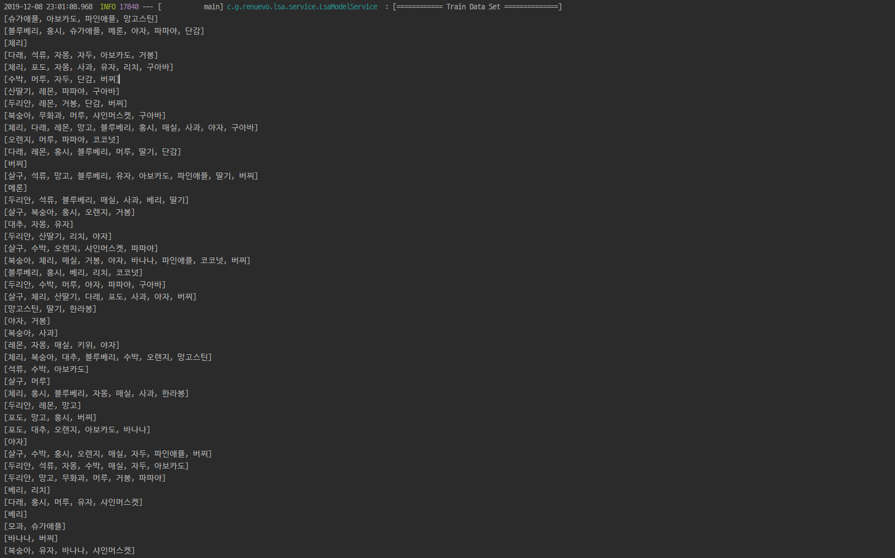
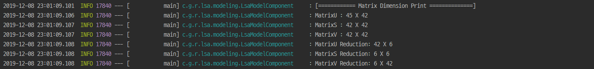

# LSA Algorithm 
***(Latent Semantic Analysis : 잠재적의미 분석)***  

**LSA**는 `차원축소`와 `동시발생빈도`를 통해 각 Item들의 유사도를 분석하는 알고리즘 이다  
LSA는 기본적으로 DTM이나 TF-IDF 행렬에 절단된 SVD(truncated SVD)를 사용하여 차원을 축소시키고, 단어들의 잠재적인 의미를 끌어낸다는 아이디어를 갖고 있습니다  

---

## Train Data Set  

일단 처음으로 `Training Data`를 준비합니다  
이 예제에서는 Rand 함수를 써서 과일 Item을 램덤적으로 생성하게 만들었습니다  

**LsaModelService.java**  
```java
    //Train Data Set Create
    List<Set<String>> trainDataList = dataRepository.createTrainDataSet(45);
```



<br/>

## Train Data matrix  

다음으로 Data Set을 기반으로 Matrix를 생성합니다  
Matrix는 Row를 데이터 쌍의 개수로 생성하고 N개의 Item을 Column으로 기준을 삼아서 생성합니다  

**LsaModelService.java**  
```java
    //Train Matrix Data Set Create
    Matrix matrix = lsaModelComponent.createMatrix(trainDataList);
```
  
*참고로 해당 이미지는 옆이 짤렸습니다*  

<br/>

## SVD And Reduction 

SVD(특이값 분해)로 한개의 Matrix를 3개의 Matrix로 분리합니다  
SVD에 대해 자세한 방법을 알고 싶으시면 :point_right: [공돌이의 수학정리노트](https://www.youtube.com/watch?v=cq5qlYtnLoY&feature=emb_logo)

  

Matrix 45 x 41개를 기준으로 SVD 알고리즘을 통해서 각각의 USV의 Matrix를 얻을 수 있습니다  

```text
A = USV
U : Row차원 공간에 Column만개의 단어에 대응되는 점으로 표현  
S : Column차원 공간에 Row만개의 문서에 대응되는 점으로 표현  
V : 차원의 중요도를 나타내는 대각행렬  
```

<br/>

이후 S(대각 행렬)과 U와 V 모두 각가의 대응되는 행과 열을 제거하여 차원을 축소해 줍니다  

   

이걸로 차원까지 축소된 SVD 값을 알게 되었습니다  
이 Matrix들을 통해서 다음과 같은 조합으로 각 Item들 간의 특이값을 통한 연관성을 알 수 있습니다  

```text
1. ROW - 차원간의 유사도 U X S 행렬의 row 간의 유사도로 계산한다  
2. ROW와 Column - ROW S X V 행렬의 column 간의 유사도로 계산한다  
3. Column - USV의 각 요소가 row와 column간의 유사도이다  
```

<br/>

  

<br/>

## LSA Sample

이후 알고 싶은 각 Matrix를 조합하여 `Cosine 유사도`를 구하면 각각의 데이터의 유사도를 찾아 낼 수 있습니다  

  

---

## 참고 사이트  
[내 마음을 알아주는 검색 LSA](https://sragent.tistory.com/entry/Latent-Semantic-AnalysisLSA)  
[딥 러닝을 이용한 자연어 처리 입문](https://wikidocs.net/24949)  
[Latent Semantic Analysis (LSA) Tutorial](https://technowiki.wordpress.com/2011/08/27/latent-semantic-analysis-lsa-tutorial/)  
[SVD 특이값 분해 (다크 프로그래머 블로그)](https://darkpgmr.tistory.com/106)  